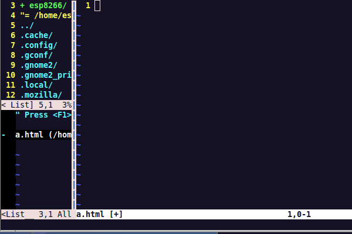

# vim
##安装插件管理工具  
git clone https://github.com/gmarik/vundle.git ~/.vim/bundle/vundle  
cp .vimrc ~/  
$vim  
:BundleInstall  

##js-beautify  
需要安装yum install node npm  
npm install -g js-beautify  

gg=G format  
ctrl+p,ctrl+n  

##example

  

